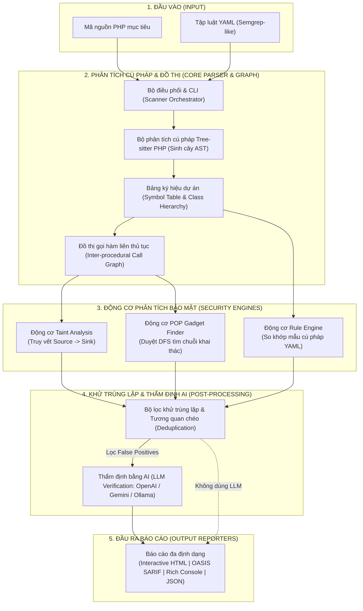

# 🛡️ PHP Insecure Deserialization & POP Gadget SAST Scanner

Công cụ phân tích mã nguồn tĩnh (**Static Application Security Testing - SAST**) chuyên sâu bằng **Python** tự động phát hiện lỗ hổng **PHP Insecure Deserialization (CWE-502)**, phân tích chuỗi **POP Gadget Chain** và hỗ trợ thẩm định bằng mô hình ngôn ngữ lớn (**LLM-assisted SAST Verification**).

---

## 🌟 Tính Năng Nổi Bật

1. **Core AST & Parsing Engine**:
   - Sử dụng **Tree-sitter PHP** hiệu năng cao, chịu lỗi cú pháp, phân tích đầy đủ PHP 7.x & 8.x.
   - Trích xuất toàn diện Class, Method, Property, Interface, Magic Methods và Call Expressions.
2. **Taint Analysis (Source-to-Sink Dataflow Tracking)**:
   - Truy vết luồng dữ liệu từ các nguồn không tin cậy (`$_GET`, `$_POST`, `$_COOKIE`, `$_REQUEST`, `php://input`, `$request->...`).
   - Phát hiện các sink trực tiếp `unserialize()` và các sink gián tiếp kích hoạt qua giao thức stream wrapper `phar://` (như `file_exists`, `is_file`, `file_get_contents`, `exif_read_data`, `unlink`, `copy`, v.v.).
   - Nhận diện các cơ chế phòng vệ an toàn (như `['allowed_classes' => false]` hoặc `json_decode`).
3. **Semgrep-compatible YAML Rule Engine**:
   - Hỗ trợ định nghĩa quy tắc quét linh hoạt bằng YAML với biến bắt giữ `$X`, wildcard `...`, `pattern-either`, `pattern-inside`, `pattern-not`, `pattern-sanitizers`.
4. **POP Gadget Chain Finder (Property-Oriented Programming)**:
   - Tự động xây dựng **Inter-procedural Call Graph** với Dynamic Dispatch.
   - Tìm kiếm đường đi từ Magic Methods (`__destruct`, `__wakeup`, `__toString`, `__call`, `__get`, `__invoke`) đến các Dangerous Sinks (`eval`, `system`, `call_user_func`, `file_put_contents`, v.v.).
   - Tạo sơ đồ cây và Blueprint cấu trúc đối tượng khai thác (Payload Blueprint).
5. **LLM-assisted Verification Module (Tham khảo `llm-sast-scanner`)**:
   - Trích xuất Code Slice thông minh và gửi đến mô hình LLM (OpenAI `gpt-4o-mini`, Google `gemini-1.5-flash`, hoặc local `ollama`).
   - Đánh giá khả năng khai thác (Exploitability), loại bỏ False Positive và đề xuất PoC / bản vá sửa lỗi.
6. **Báo cáo Đa định dạng**:
   - **Rich Terminal Console**: Giao diện dòng lệnh trực quan với bảng màu, highlight code snippet và cây đường đi POP.
   - **OASIS SARIF v2.1.0**: Tương thích GitHub Security, GitLab SAST, VS Code SARIF Viewer.
   - **Interactive HTML Report**: Giao diện web tĩnh glassmorphism hiện đại, tìm kiếm, lọc theo mức độ nghiêm trọng và POP chains.
   - **JSON**: Dễ dàng tích hợp vào CI/CD pipeline và công cụ tự động hóa.

---

## 🏗️ Kiến trúc Hệ thống



---

## 🚀 Cài Đặt & Khởi Chạy

### 1. Yêu cầu Môi trường
- Python 3.9+
- Pip

### 2. Cài đặt Dependencies
```bash
pip install -r requirements.txt
```

---

## 💻 Hướng Dẫn Sử Dụng CLI

### 1. Quét Toàn Bộ Thư Mục Mã Nguồn PHP
```bash
# Quét hiển thị giao diện Terminal Rich
python -m php_deserial_sast.cli scan /path/to/php/project

# Quét và xuất báo cáo HTML tương tác
python -m php_deserial_sast.cli scan /path/to/php/project --format html --output report.html

# Quét và xuất báo cáo chuẩn SARIF cho CI/CD
python -m php_deserial_sast.cli scan /path/to/php/project --format sarif --output report.sarif
```

### 2. Chỉ Tìm Kiếm Chuỗi POP Gadget Chains
```bash
python -m php_deserial_sast.cli find-gadgets /path/to/php/project --max-depth 6
```

### 3. Bật Thẩm Định Bằng LLM (Giảm False Positive)
```bash
# Sử dụng OpenAI API
export OPENAI_API_KEY="your-api-key"
python -m php_deserial_sast.cli scan /path/to/php/project --llm --llm-provider openai --llm-model gpt-4o-mini

# Sử dụng Google Gemini API
export GEMINI_API_KEY="your-api-key"
python -m php_deserial_sast.cli scan /path/to/php/project --llm --llm-provider gemini --llm-model gemini-1.5-flash

# Sử dụng Ollama Local (Mô hình chạy cục bộ không gửi code ra ngoài)
python -m php_deserial_sast.cli scan /path/to/php/project --llm --llm-provider ollama --llm-model qwen2.5-coder:7b
```

### 4. Kiểm Tra Cú Pháp Tập Luật YAML
```bash
python -m php_deserial_sast.cli verify-rules
```

---

## 📝 Viết Custom Rule Định Dạng YAML

Quy tắc được đặt trong thư mục `php_deserial_sast/rules/definitions/` hoặc thư mục tùy chỉnh truyền qua `--rules-dir`:

```yaml
rules:
  - id: custom-unserialize-rule
    message: "Direct call to unserialize() detected with user parameter $INPUT"
    severity: CRITICAL
    confidence: HIGH
    cwe: "CWE-502: Deserialization of Untrusted Data"
    owasp: "A08:2021-Software and Data Integrity Failures"
    remediation: "Use json_decode() or pass ['allowed_classes' => false]."
    pattern: "unserialize($INPUT)"
    pattern-not:
      - pattern: "unserialize($INPUT, ['allowed_classes' => false])"
```

---

## 🧪 Kiểm Thử Tự Động (Test Suite)

Dự án đi kèm bộ unit test toàn diện cho tất cả các thành phần:

```bash
python -m pytest tests/ -v
```

Kết quả:
```
tests/test_gadget_finder.py::test_pop_gadget_chain_discovery PASSED
tests/test_parser.py::test_parser_basic PASSED
tests/test_parser.py::test_ast_visitor_extraction PASSED
tests/test_reporters.py::test_full_scan_and_reports PASSED
tests/test_rules.py::test_rule_engine_loading PASSED
tests/test_rules.py::test_rule_engine_evaluation PASSED
tests/test_taint.py::test_taint_direct_unserialize PASSED
tests/test_taint.py::test_taint_safe_allowed_classes PASSED
tests/test_taint.py::test_taint_phar_deserialization PASSED
============================== 9 passed in 1.13s ==============================
```

---

## 📚 Tài Liệu Tham Khảo

1. [PayloadsAllTheThings - PHP Insecure Deserialization](https://github.com/swisskyrepo/PayloadsAllTheThings/blob/master/Insecure%20Deserialization/PHP.md)
2. [PHPGGC - PHP Generic Gadget Chains](https://github.com/ambionics/phpggc)
3. [SunWeb3Sec/llm-sast-scanner - LLM-Assisted SAST](https://github.com/SunWeb3Sec/llm-sast-scanner)
4. [Semgrep - Static Analysis Engine](https://github.com/semgrep/semgrep)
